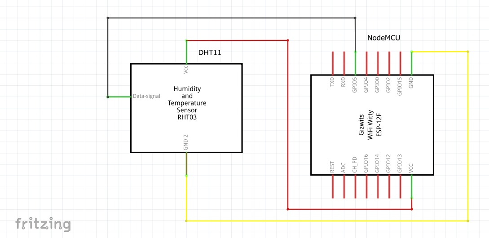
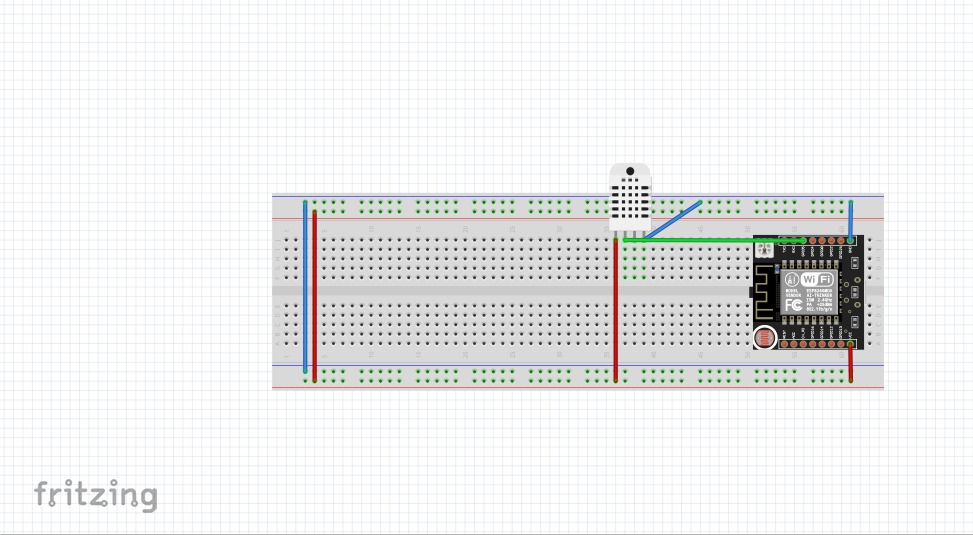

                                                                       Temperature Humidity Sensor via ThingSpeak
In a nation like Canada where the weather conditions are uncertain for a majority of time, the residents always keep themselves updated about the knowledge of temperature and humidity in their diurnal life. As this country experiences eight months of harsh winters, which makes it one of the coldest nations in the world [1], the significance of temperature and humidity sensors is on plateau with getting the houses insulated. In addition, humidity is as important as temperature to know on a diurnal basis. Moreover, temperature and humidity both have a myriad of vital roles in our environment – like production of food, maintaining health, preventing the growth of molds and bacteria, etc. [3]. Therefore, we would like to propose this set up so that it proves useful in mapping accurate temperature and humidity. 

Our project is all about sensing the approximate temperature and humidity in the environment using DHT11 sensor and sending a tweet on the Twitter via ThingSpeak.com. This works while linking the NodeMCU with the Twitter so that we can tweet the current weather conditions with appropriate message on the Twitter. To make the set up more facile to utilize, once the code is executed, the sensor senses the temperature and humidity every hour and tweets on the Tweeter with appropriate comments. This works while connecting the NodeMCU to the ThinkSpeak.com.  
 
Repository Contents:
•	README.MD
•	Code to measure temperature and humidity
•	Image file: Images of materials required for project
•	Libraries file: Libraries used in the project 

Requirements and Materials:
      List of Materials:
           •	1 * Breadboard
           •	1 * DHT11
           •	1 * Node MCU
           •	8 * wires
           •	1 * resistor
           •	Data Cable

Build Instructions: 
          Schematic diagram of the circuit are as follows: 
          
	 
                                      
				      
				      Fig : Schematic diagram of the circuit

Below that is the breadboard view of the project.
                     
 
			
			Fig : Breadboard diagram of the circuit
Usage:

•	Upload the code to the breadboard using Arduino software.
•	Press the button for recording the current temperature and humidity.
•	ThingSpeak links the Arduino to the Twitter over wifi and tweets the appropriate message on the Twitter.
•	This set up can be used anywhere to sense the temperature and humidity. For instance, at home, offices and other institutions. 

Team:

•	Kush Shihora: Write up and presentation

•	Prit Akbari: Coding and presentation

•	Ishit Vasani: Build-up and modification of the circuit and presentation. 

Credits:

•	ThingSpeak: Ideas about how to link the Twitter to the wifi. 
	

CITATIONS:
3] https://www.makeuseof.com/tag/4-health-benefits-monitoring-temp-humidity-home/

